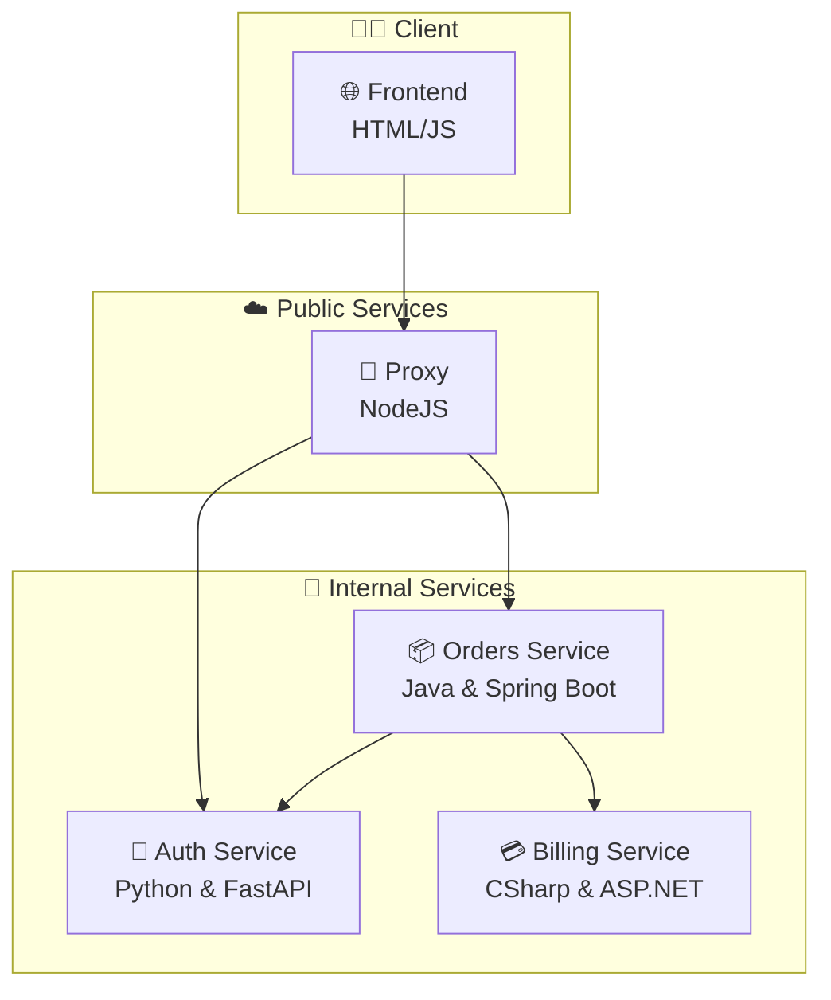

# 🔧 GitStream Automation Demo

A full-stack demo app used to showcase `gitStream` automations like AI, `codeExperts`, contributor mapping, and PR workflows.

### 🗂️ Structure

- `frontend/` – HTML/JS UI and NodeJS proxy
- `services/auth-python/` – Auth (FastAPI)
- `services/billing-csharp/` – Billing (.NET Core)
- `services/orders-java/` – Orders (Spring Boot)
- `.cm/` – gitStream config
- `docker-compose.yml` – Runs everything


## 🧭 Architecture




### 🚀 Usage

```bash
docker-compose up --build
```
Open a browser to http://localhost:3000/
